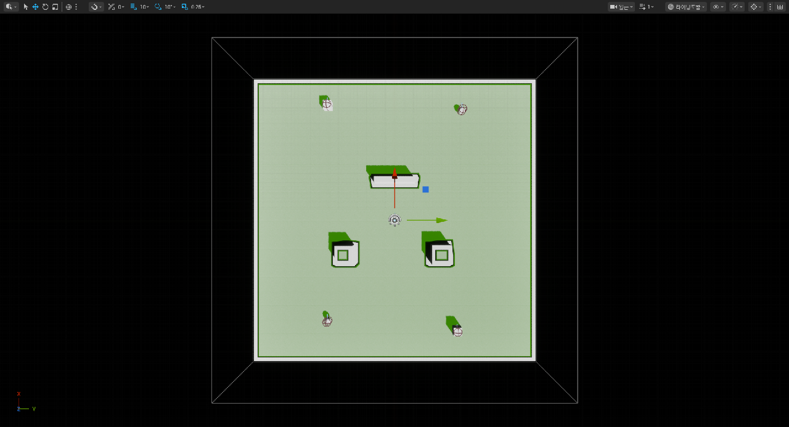
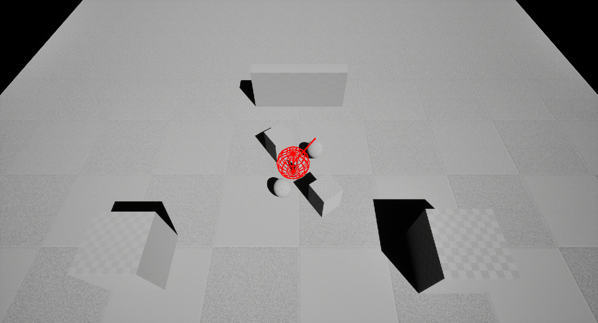
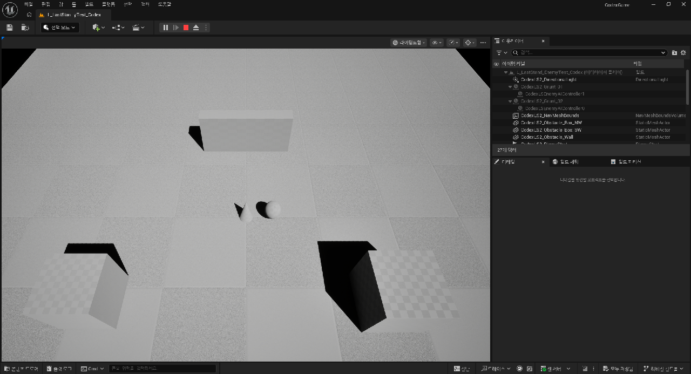

# PROJECT: LAST STAND — STEP 2 Enemy + AI + GAS Combat

## STEP 상태

| 항목 | 값 |
|---|---|
| Agent | Codex |
| Unreal Engine | 5.8.2 (CL 56702186) |
| Start Time | 2026-08-28 14:53:41 +09:00 |
| End Time | 2026-08-29 00:53:59 +09:00 |
| Elapsed Time | 10시간 0분 18초 (600.30분) |
| 결과 | STEP 2 완료, STEP 3 미진행 |
| Test Level | `/Game/AgentGameTest/Codex/Levels/L_LastStand_EnemyTest_Codex` |

이번 STEP에서는 STEP 1 Player/GAS 구조를 유지한 채 Enemy Base, Grunt, Runner, 전용 AIController, GAS Melee Ability, Enemy 초기 Attribute/Cooldown Effect, 사망 Delegate, Navigation Test Level을 추가했다. Wave, Spawner, Score, Victory, Game Over UI, HUD, 최종 Arena, Niagara, Audio는 구현하지 않았다.

## Architecture

```text
ACodexLSEnemyCharacter (공통 ACharacter + ASC + AttributeSet + Death)
├─ ACodexLSEnemyGrunt
└─ ACodexLSEnemyRunner

ACodexLSEnemyAIController
└─ Idle → Chase → Attack / Dead
```

- Enemy ASC 위치: `ACodexLSEnemyCharacter`
- Owner Actor: Enemy Character 자신
- Avatar Actor: Enemy Character 자신
- Replication Mode: `Minimal`
- 이유: 이번 Enemy는 사망 후 제거되는 일반 AI Pawn이며 Respawn 뒤에도 GAS 상태를 보존할 필요가 없다. PlayerState를 억지로 추가하지 않고 수명과 소유권이 같은 Character에 ASC를 두는 구성이 가장 단순하다.
- Ability/Attribute 초기화는 Authority에서 수행하며, 초기 Attribute 적용 Guard와 기존 Ability Class 검색으로 중복 적용·Grant를 막는다.
- 실제 런타임 로직은 native C++ Class가 담당하고 `/Game`의 BP/GA/GE는 편집·검사용 data-only 파생 Asset이다.

STEP 1에서 만든 공용 `UCodexLSAttributeSet`과 `UCodexLSGE_Damage`를 그대로 재사용했다. Player 전용 복사본을 만들지 않았으며 `Health`, `MaxHealth`, `IncomingDamage`가 Actor 종류와 무관한 전투 Attribute이기 때문이다.

## Enemy 수치와 외형

| 항목 | Grunt | Runner |
|---|---:|---:|
| Health / MaxHealth | 100 / 100 | 60 / 60 |
| Move Speed | 285 cm/s | 520 cm/s |
| Melee Damage | 18 | 10 |
| Attack Cooldown | 1.5초 | 0.9초 |
| Attack Range | 165 cm | 145 cm |
| Trace Radius | 70 cm | 60 cm |
| Test Mesh | 큰 Cube | 작은 Sphere |
| Test Color | Dark Red | Orange |

Grunt는 느리고 크며 HP와 한 방 Damage가 높다. Runner는 작고 HP가 낮지만 약 1.82배 빠르게 접근하고 공격 간격도 짧다. 외형뿐 아니라 HP, 이동속도, Damage, Cooldown, Range가 모두 다르다.

Enemy 초기값은 직접 Attribute를 대입하지 않는다.

```text
Enemy BeginPlay
→ ASC InitAbilityActorInfo(Self, Self)
→ UCodexLSGE_EnemyDefaultAttributes Spec
→ SetByCaller(Data.MaxHealth, Archetype MaxHealth)
→ SetByCaller(Data.Health, Archetype MaxHealth)
→ ApplyGameplayEffectSpecToSelf
```

## AI 구현

작은 Arena의 단일 Player 추적에 Behavior Tree/StateTree는 과도하다고 판단해 전용 C++ `AIController`와 명시적 State Logic을 선택했다.

- Controller Tick Interval: 0.15초
- Target: 최초/무효 시점에만 `GetPlayerCharacter(0)`으로 확보한 뒤 `TWeakObjectPtr`로 캐시
- 재탐색 간격: 0.75초
- Chase: `MoveToActor`, NavMesh Path Following 사용
- Acceptance Radius: `AttackRange * 0.8` (`Grunt=132`, `Runner=116`)
- Attack: Range 안에서 이동을 멈추고 `Ability.Enemy.MeleeAttack` 활성화 요청만 수행
- 중복 Attack 방지: `State.Enemy.Attacking`, `Cooldown.Enemy.MeleeAttack`, `State.Enemy.Dead`를 확인
- 충돌 완화: Character Capsule과 RVO Avoidance 사용
- Player 사망: `State.Player.Dead` 또는 `Health <= 0`이면 Target 해제, 이동 정지, Idle 전환
- Enemy 사망: Dead 전환 후 Controller Tick 자체를 비활성화

AIController는 Damage를 직접 적용하지 않는다.

```text
Idle
→ 유효 Player 캐시
→ Chase + MoveToActor
→ Attack Range 진입
→ StopMovement
→ Enemy ASC에 Ability Tag 기반 활성화 요청
→ Cooldown 종료 후 다음 Attack
```

## Enemy GAS Ability

`UCodexLSGA_EnemyMeleeAttack`은 `ServerOnly`, `InstancedPerActor` Ability다.

```text
AI Attack 요청
→ Enemy ASC
→ Ability.Enemy.MeleeAttack 검색/활성화
→ State.Enemy.Attacking 보유
→ CommitAbility + GAS Cooldown 적용
→ 0.16초 Windup
→ Pawn Object Sphere Sweep
→ 캐시된 Player만 Target으로 승인
→ 공용 UCodexLSGE_Damage
→ SetByCaller(Data.Damage)
→ Player ASC / UCodexLSAttributeSet
→ Health 감소
```

- Self는 Trace Query에서 제외한다.
- 다른 Enemy가 Sweep에 포함돼도 캐시된 Player와 일치하는 Hit만 승인한다.
- `State.Enemy.Dead`는 Ability Activation Block Tag다.
- Cooldown Duration은 `Data.Cooldown` SetByCaller로 Grunt 1.5초, Runner 0.9초를 공용 GE 하나에 전달한다.
- 실제 Runner 런타임 Inspector에서 `Cooldown.Enemy.MeleeAttack`과 `Default__CodexLSGE_EnemyMeleeCooldown`, 총 0.9초, 잔여 약 0.65초를 확인했다.

## 양방향 Damage 흐름

### Enemy → Player

```text
ACodexLSEnemyAIController
→ UCodexLSGA_EnemyMeleeAttack 활성화 요청
→ ACodexLSEnemyCharacter::PerformMeleeAttack
→ Sphere Sweep Hit
→ UCodexLSGE_Damage Spec
→ SetByCaller(Data.Damage=18 또는 10)
→ Player ASC
→ UCodexLSAttributeSet.IncomingDamage
→ Health Clamp
```

실제 PIE에서 Grunt는 Hit당 18, Runner는 Hit당 10을 적용했다. Runner는 약 1.05초 간격으로 반복 Hit했고 100 HP Player가 정확히 10회 Hit 뒤 0이 됐다.

### Player → Enemy

```text
Left Mouse / Primary Attack Input Tag
→ UCodexLSGA_PrimaryAttack
→ Visibility Hitscan
→ Enemy IAbilitySystemInterface
→ Enemy ASC
→ 공용 UCodexLSGE_Damage
→ SetByCaller(Data.Damage=20)
→ 공용 UCodexLSAttributeSet
→ Enemy Health 감소
```

실제 PIE에서 Grunt는 `100 → 80 → 60 → 40 → 20 → 0`, Runner는 `60 → 40 → 20 → 0`으로 감소했다. 2 Grunt + 2 Runner 동시 테스트에서는 실제 Player 입력 경로로 16회 Hit하여 네 Enemy를 모두 사망시켰다.

## Enemy Death와 STEP 3 연결점

```text
Health Change Delegate
→ Health <= 0 && !bDead
→ bDead=true
→ 모든 Ability Cancel
→ State.Enemy.Dead 추가
→ AI Dead / Tick 정지
→ Movement 정지·Disable
→ Capsule/Visual Collision Disable
→ OnEnemyDeath.Broadcast(this)
→ 1.5초 뒤 Destroy
```

- `bDead` Guard로 Death 처리, Delegate Broadcast, Destroy 예약은 정확히 1회만 실행된다.
- Dead Tag가 Ability Activation을 차단하고 Collision도 비활성화하므로 사망 뒤 추가 Damage/Attack이 문제를 만들지 않는다.
- `OnEnemyDeath`는 `BlueprintAssignable` Dynamic Multicast Delegate다. STEP 3 Wave Manager/Score가 Enemy를 Spawn한 뒤 구독할 수 있지만 이번 STEP에서는 구독자, Wave Counter, Score를 만들지 않았다.
- 다수 전투 로그에서 네 Enemy 각각 `DeathEvent=BroadcastOnce`와 `DeadTag=present`를 확인했다.

## GameplayTag

| Tag | 용도 |
|---|---|
| `Ability.Enemy.MeleeAttack` | Enemy Melee Ability 식별/활성화 |
| `State.Enemy.Attacking` | Windup/공격 Ability 활성 상태 |
| `State.Enemy.Dead` | 사망 상태와 Ability 차단 |
| `State.Player.Dead` | Player HP 0 상태와 Enemy Target 차단 |
| `Cooldown.Enemy.MeleeAttack` | Enemy GAS 공격 Cooldown |
| `Enemy.Type.Grunt` | Grunt Archetype 식별 |
| `Enemy.Type.Runner` | Runner Archetype 식별 |
| `Data.Health` | 초기 Health SetByCaller |
| `Data.MaxHealth` | 초기 MaxHealth SetByCaller |
| `Data.Cooldown` | 공격 Cooldown Duration SetByCaller |
| `Data.Damage` | STEP 1 공용 Damage SetByCaller 재사용 |

Unreal GameplayTags Toolset에서 등록 상태를 실제 조회했다.

## 생성/수정한 C++

### 생성

| 파일 | 주요 Class |
|---|---|
| `CodexLSEnemyCharacter.h/.cpp` | `ACodexLSEnemyCharacter`, `ACodexLSEnemyGrunt`, `ACodexLSEnemyRunner` |
| `CodexLSEnemyAIController.h/.cpp` | `ACodexLSEnemyAIController`, `ECodexLSEnemyAIState` |

- C++ Files Created: 4

### 수정

- `CodexGame.Build.cs`: `AIModule`, `NavigationSystem` 의존성 추가
- `CodexLSGameplayTags.h/.cpp`: STEP 2 Tag 추가
- `CodexLSGameplayAbilities.h/.cpp`: Enemy Melee Ability 추가
- `CodexLSGameplayEffects.h/.cpp`: Enemy Default Attribute/Cooldown GE 추가
- `CodexLSPlayerCharacter.h/.cpp`: Player HP 0와 `State.Player.Dead` 최소 기반 추가
- `CodexLSPlayerController.h/.cpp`: 실제 PIE 반복 검증용 STEP 2 QA Key/Scenario 보조 기능 추가

- Existing C++ Files Modified: 11

Player QA Key는 `F9=Solo Grunt`, `F10=Solo Runner`, `F11=Multi`, `F12=실제 LMB 입력 경로 공격`, `Insert=Snapshot`, `Home=검증용 HP Boost`, `End=Lit View`다. 이는 테스트 자동화 보조이며 AI/GAS 전투 구현을 대체하지 않는다.

## 생성한 Unreal Asset

| 종류 | Asset |
|---|---|
| Enemy Blueprint | `/Game/AgentGameTest/Codex/Blueprints/BP_Enemy_Base_Codex` |
| Enemy Blueprint | `/Game/AgentGameTest/Codex/Blueprints/BP_Enemy_Grunt_Codex` |
| Enemy Blueprint | `/Game/AgentGameTest/Codex/Blueprints/BP_Enemy_Runner_Codex` |
| AIController Blueprint | `/Game/AgentGameTest/Codex/Blueprints/BP_Enemy_AIController_Codex` |
| GameplayAbility | `/Game/AgentGameTest/Codex/Abilities/GA_Enemy_MeleeAttack` |
| GameplayEffect | `/Game/AgentGameTest/Codex/Effects/GE_Enemy_DefaultAttributes` |
| GameplayEffect | `/Game/AgentGameTest/Codex/Effects/GE_Cooldown_Enemy_MeleeAttack` |
| Level | `/Game/AgentGameTest/Codex/Levels/L_LastStand_EnemyTest_Codex` |

- General Blueprints Created: 4
- GameplayAbilities Created: 1
- GameplayEffects Created: 2
- Levels Created: 1
- Total Unreal Assets Created: 8
- Materials / MaterialInstances / Textures / StaticMeshes / NiagaraSystems / Widgets: 0

외부 Asset은 사용하지 않았다. Engine 기본 Cube/Sphere와 기본 Level Primitive만 사용했다.

## Test Level과 Navigation

`L_LastStand_EnemyTest_Codex`는 약 30 m × 30 m 검증용 Level이다.

- Floor 1
- PlayerStart 1
- 장애물 3
- Grunt 2
- Runner 2
- NavMeshBoundsVolume 1
- DirectionalLight / SkyLight

Editor의 Build Paths를 실제 실행해 RecastNavMesh를 빌드하고 Level을 저장했다. Navigation Debug에서 이동 가능 영역과 장애물 주변 Cutout을 확인했다.

초기 위치와 약 3초 뒤 위치:

| Enemy | 시작 | 약 3초 뒤 |
|---|---|---|
| Grunt A | `(1200,-700,90)` | `(605,-386,90)` |
| Grunt B | `(-1150,650,90)` | `(-565,319,90)` |
| Runner A | `(1150,700,90)` | `(122,89,90)` |
| Runner B | `(-1050,-700,90)` | `(-94,-62,90)` |

네 Enemy 모두 `MoveTo Result=2`로 Path 요청을 수락했고, Runner가 Grunt보다 명확히 먼저 Player 근처에 도착했다. 장애물 때문에 정지하지 않았으며 RVO로 네 Character가 완전히 같은 한 점에 겹치는 현상을 완화했다.







## Build 기록

| Build | 결과 | 시간 | 내용 / 실패 원인 |
|---|---:|---:|---|
| #1 | FAIL | 55.06초 | `const APawn*`을 non-const getter에 전달한 C2664 1건 |
| #2 | SUCCESS | 8.57초 | const 타입 수정 후 성공 |
| #3 | SUCCESS | 18.24초 | Enemy Visibility Collision 수정 |
| #4 | SUCCESS | 22.55초 | AI Dead Player 필터와 QA 보조 수정 |
| #5 | SUCCESS | 16.37초 | 최종 회귀용 수정 Build |
| #6 | SUCCESS | 15.69초 | Editor ViewMode 충돌을 피한 최종 QA Key Build |

- Build Attempts: 6
- Successful Builds: 5
- Failed Builds: 1
- Compile Errors: 1, 해결 완료
- Compile Warnings: 0
- 최종 Build: SUCCESS

Data-only BP/GA/GE 7개는 최종 binary Build 뒤 `warnings_as_errors=true`로 모두 다시 Compile했고 전부 성공했다.

## Asset 생성 Commandlet

`Scripts/AgentGameTest/Codex/BuildStep02Assets.py`가 7개 data-only Asset과 STEP 2 Test Level을 생성/갱신했다.

최종 Marker:

```text
CODEX_STEP2_ASSET_BUILD_SUCCESS enemy_assets=7 newly_created=0 level=/Game/AgentGameTest/Codex/Levels/L_LastStand_EnemyTest_Codex
```

Script 작업은 성공했지만 프로젝트 시작부터 존재한 `GameFeatureData` AssetManager Rule 누락 오류 때문에 Commandlet Process는 Marker 출력 뒤 Exit 1을 반환했다. STEP 2 Asset, Blueprint Compile, Editor Build, PIE Runtime과 무관한 기존 프로젝트 설정 문제다.

## PIE 테스트

| PIE | 결과 | 검증 내용 |
|---|---|---|
| #1 | FAIL 후 수정 | Enemy 초기화는 정상, Capsule Visibility 설정 때문에 지면을 통과하는 문제 발견 |
| #2 | FAIL 후 수정 | Capsule Collision 수정 후 15 m Floor 밖 Enemy가 낙하하는 Level 크기 문제 발견 |
| #3 | SUCCESS | 30 m Floor에서 4 Enemy MoveTo, Enemy Damage, Player HP 0 확인 |
| #4 | FAIL 후 수정 | Solo Grunt Scenario에서 Nav Path가 없어 정지, NavMesh Build 필요 확인 |
| #5 | SUCCESS | Solo Grunt: 5 × 20 Damage, HP 100→0, Dead Tag/AI Stop/Destroy/Delegate 확인 |
| #6 | SUCCESS | NavMesh Build 뒤 Grunt x2 + Runner x2 추적, Player HP 0 확인 |
| #7 | SUCCESS | Multi: 실제 LMB 경로 16 Hit, Runner 2/Grunt 2 모두 사망, Living=0 |
| #8 | SUCCESS | Solo Runner: 빠른 접근, 10 Damage, 0.9초 Cooldown, Player HP 0 확인 |
| #9 | SUCCESS | Solo Runner 반복 실행과 PIE 재초기화 확인 |
| #10 | SUCCESS | Solo Runner Target/Chase/Attack 반복 및 사망 Player 공격 중단 확인 |
| #11 | SUCCESS | Player 사망 상태 GAS Inspector와 AI Idle 전환 회귀 확인 |
| #12 | SUCCESS | Runner GAS Inspector: Attribute/Ability/Attacking/Cooldown Tag와 Effect 확인 |
| #13 | SUCCESS | Player Health 100→0, `State.Player.Dead`, 2초 뒤 추가 Hit/Target 재획득 없음 |
| #14 | SUCCESS | Grunt x2 + Runner x2 최종 Lit 전투 캡처와 Runtime Error Scan |
| #15 | SUCCESS | Solo Grunt 최종 회귀: 950 cm Nav Chase, 18 Damage × 6, Player HP 0, AI Idle 전환 |

- PIE Test Runs: 15
- 최종 결과: SUCCESS
- Blueprint Runtime Errors: 0
- Accessed None: 0
- Runtime Errors: 0
- Invalid GameplayTag / Invalid ASC / 치명적 GAS Warning: 0

### Grunt 단독

- ASC Owner/Avatar: `BP_Enemy_Grunt_Codex` 자신
- Health/MaxHealth: 100/100
- Speed/Damage/Cooldown/Range: 285 / 18 / 1.5 / 165
- 950 cm 거리에서 NavMesh로 추적해 `Chase → Attack` 전환
- Enemy Attack: 18 Damage × 6, Player 100→82→64→46→28→10→0
- Player 0 HP 뒤 Grunt AI `Attack → Idle`, 추가 Hit 없음
- Player Attack: 20 Damage × 5
- 사망: `State.Enemy.Dead`, AI `Chase → Dead`, Collision Off, `DeathEvent=BroadcastOnce`, 1.5초 뒤 Destroy

### Runner 단독

- ASC Owner/Avatar: `BP_Enemy_Runner_Codex` 자신
- Health/MaxHealth: 60/60
- Speed/Damage/Cooldown/Range: 520 / 10 / 0.9 / 145
- 950 cm에서 약 1.9초 뒤 270 cm, 이후 약 111 cm Attack 위치까지 접근
- Enemy Attack: 10 Damage, 실제 Hit 간격 약 1.05초
- Cooldown Inspector: `Cooldown.Enemy.MeleeAttack`, Duration 0.9초 확인
- Player HP: 100→0, 이후 AI `Attack → Idle`, 추가 Hit 없음
- Player Attack에 의한 Runner 사망은 Multi PIE에서 각 20 Damage × 3으로 확인

### 다수 Enemy

- 배치: Grunt 2 + Runner 2
- 네 Enemy 모두 Target 획득, Nav MoveTo 수락, Chase/Attack 전환
- 실제 Player Primary Attack 입력 경로로 Runner는 3 Hit, Grunt는 5 Hit 후 각각 사망
- Enemy Death Event 네 건 모두 1회만 Broadcast
- 최종 Snapshot: `PlayerHealth=872/1000 Enemies=0 Living=0`
- 치명적 Runtime Error: 0

### Player HP 0

- Runner 10 Hit 뒤 Player Attribute: `Health=0`, `MaxHealth=100`
- Player Active Tag: `State.Player.Dead`
- Player Ability 두 개는 비활성 상태
- Runner AI: `Attack → Idle`
- 사망 뒤 2초 이상 추가 Melee Hit와 Target 재획득 없음

## Runtime 오류 검사

최종 PIE 세션 이후 다음 Pattern을 로그에서 검사했다.

```text
Accessed None
Blueprint Runtime Error
Ensure condition failed
Assertion failed
Invalid GameplayTag
LogCodexLastStand: Error
Fatal error
Unhandled Exception
```

Critical Count는 0이다. PIE 종료 teardown 중 `CrowdManager`가 이미 정리된 RecastNavMesh를 찾는 `LogCrowdFollowing` 경고 1건이 있었고, `BeginTearingDown`과 `CleanupWorld` 사이에만 발생했다. Gameplay/Navigation 실행 중 경고는 아니다.

## 요구사항 완료율

| 그룹 | 요구사항 | 완료 | 실패 |
|---|---:|---:|---:|
| Enemy Foundation | 4 | 4 | 0 |
| Grunt | 5 | 5 | 0 |
| Runner | 5 | 5 | 0 |
| AI | 6 | 6 | 0 |
| GAS Combat | 5 | 5 | 0 |
| Death | 6 | 6 | 0 |
| Validation | 6 | 6 | 0 |
| 합계 | 37 | 37 | 0 |

Completion Rate: **100%**

## 오류와 Tool 기록

| 항목 | 값 |
|---|---:|
| Debug Iterations | 8 |
| Unreal MCP Calls / Failures | N/A / N/A |
| Blender MCP Calls / Failures | 0 / 0 |
| Blueprint Compile Errors | 0 |
| C++ Compile Errors | 1, 해결 완료 |
| Blueprint Runtime Errors | 0 |
| Gameplay Runtime Errors | 0 |

Debug Iteration은 C++ const Compile, Capsule Collision, Floor 크기, NavMesh Build/저장, Solo Scenario 위치, Dead Player Target 필터, Editor ViewMode와 QA Key 충돌, 기존 STEP 1 Asset 우발적 재저장 정리의 8개 수정 주기로 집계했다.

Unreal MCP는 Toolset/Editor/Slate/GAS Inspector 호출을 다수 사용했지만 현재 전송 계층에서 STEP별 총 호출과 실패 횟수를 신뢰할 수 있게 집계하지 못해 추측하지 않고 `N/A`로 기록했다. Unreal MCP로 Level/Asset/Tag/Blueprint Compile/GAS Runtime/Slate PIE/Navigation 상태를 검증했다. Blender MCP는 이번 STEP 범위에 필요하지 않아 사용하지 않았다.

## 생성 Asset 집계

| 항목 | 수량 |
|---|---:|
| C++ Files Created | 4 |
| C++ Files Modified | 11 |
| General Blueprints Created | 4 |
| GameplayAbilities Created | 1 |
| GameplayEffects Created | 2 |
| InputActions / InputMappingContexts | 0 / 0 |
| Levels Created | 1 |
| Materials / MaterialInstances / Textures | 0 / 0 / 0 |
| StaticMeshes Created | 0 |
| NiagaraSystems / Widgets | 0 / 0 |
| Total Unreal Assets Created | 8 |

External Assets: None.

## 변경량

| 항목 | 수량 |
|---|---:|
| Files Added | 18 |
| Files Modified | 13 |
| Files Deleted | 0 |
| 구현 Text Lines Added | 1,600 |
| 구현 Text Lines Deleted | 1 |

Line 수치는 문서와 binary Unreal Asset/PNG를 제외하고 C++/script 변경만 집계한다. File 수치는 STEP 2 문서와 증거 PNG를 포함한다.

## 측정값

- Reported Token Usage (root + STEP 2 subagent 3개)
  - Input Tokens: 42,118,236
  - Cached Input Tokens: 40,937,216 (Input Tokens의 부분집합)
  - Output Tokens: 176,585
  - Reasoning Output Tokens: 71,890 (Output Tokens의 부분집합)
  - Total Tokens: 42,294,821
- Context Start / End: 80,545 / 258,400 → 204,524 / 258,400
- Context Increase: +123,979
- Usage Limit at STEP End: 5 Hour 25%, Weekly 51%
- User Intervention Count: 0
- Manual Action Requests: 0
- Unreal MCP Calls: N/A
- Blender MCP Calls: 0

Token은 로컬 Codex rollout의 실제 `token_count` 누적 counter로 계산했다. Root는 STEP 2 사용자 메시지 직전 counter와 최종 응답 직후 counter의 차이를 사용했고, STEP 2에서 새로 생성된 subagent 3개는 각 rollout의 최종 누적값 전체를 합산했다. Cached Input은 Input에, Reasoning Output은 Output에 이미 포함되므로 Total에 다시 더하지 않았다. Context 값은 root task의 첫/마지막 inference에서 보고된 `last_token_usage.input_tokens / model_context_window`이며 별도의 UI context occupancy 추정치가 아니다.

사용자가 보낸 “이어서 진행해줘”는 중단된 동일 STEP의 계속 실행 요청이며 구현 수정이나 수동 Editor 조작을 제공한 Intervention으로 집계하지 않았다. 모든 Build, Asset 생성, Editor Build Paths, PIE 입력, GAS Inspector, 캡처는 Agent가 수행했다.

## Known Issues

- 프로젝트 기존 `AllToolsets/GameFeatures` 구성에 `GameFeatureData` AssetManager Rule 누락 오류가 남아 있다. STEP 2 Gameplay/GAS Runtime 오류가 아니며 Editor Build, 7개 Blueprint Compile, Navigation Build, PIE와 GAS Inspector는 정상 통과했다. 이 기존 오류 때문에 asset-generation Commandlet가 성공 Marker 뒤 Exit 1을 반환한다.
- PIE 종료 teardown에서만 `LogCrowdFollowing: Unable to find RecastNavMesh instance while trying to create UCrowdManager instance` 경고 1건이 발생한다. 실행 중 Navigation과 네 Enemy의 MoveTo는 정상이다.
- 외형과 Feedback은 Engine Primitive와 Debug Trace/Sphere 수준이다. 최종 Environment Art와 Niagara/VFX는 각각 STEP 4와 STEP 6 범위다.
- Online/Multiplayer 전투 Framework는 명시적으로 범위 밖이며 Standalone PIE 기준으로 검증했다.

## 자체 평가

| 항목 | 점수 / 10 |
|---|---:|
| Code Quality | 9 |
| Architecture | 9 |
| Feature Completeness | 10 |
| Stability | 9 |
| Visual Quality | 6 |
| Tool Efficiency | 7 |
| Autonomy | 10 |

## 결론

STEP 2의 Enemy 2종, AI Navigation, GAS 기반 양방향 전투, Cooldown, Death/Delegate, C++ Build, data-only Blueprint Compile, 실제 PIE 15회와 문서 기록을 완료했다. STEP 3에서 Spawner가 Enemy를 생성하고 `OnEnemyDeath`를 구독해 Wave/Score/Victory/Game Over 흐름으로 확장할 수 있으며, 이번 작업에서는 STEP 3을 시작하지 않았다.
