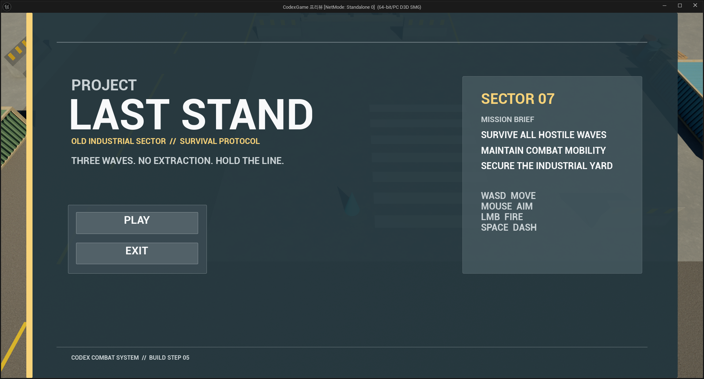
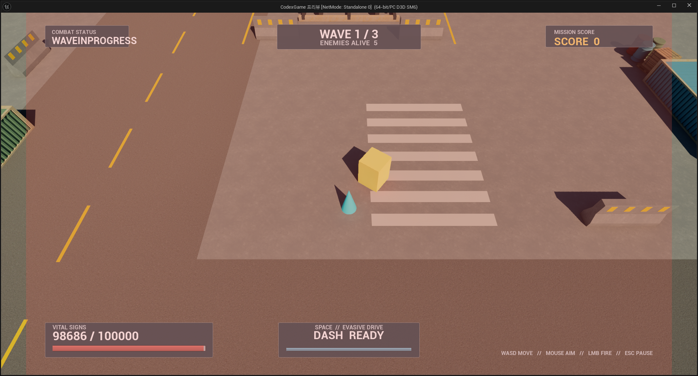
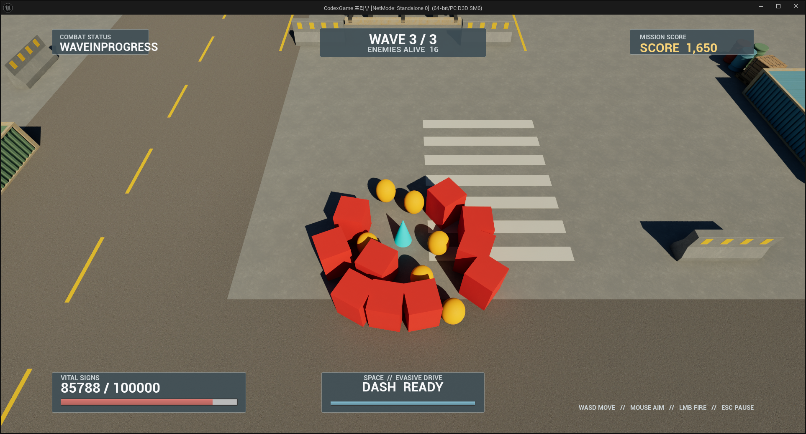
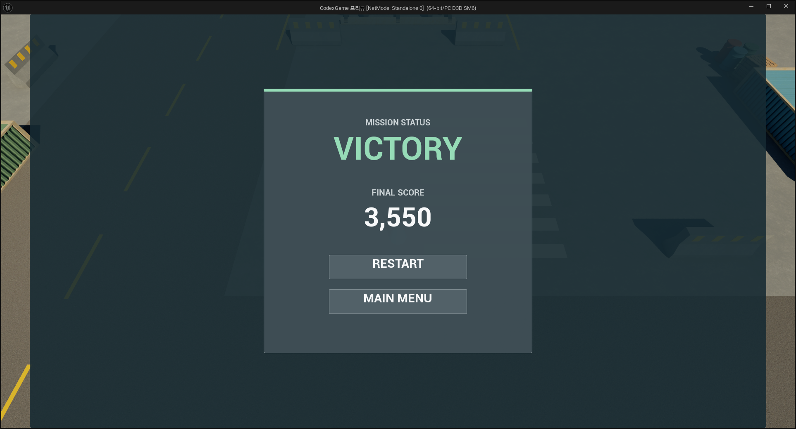

# PROJECT: LAST STAND

Unreal Engine 5와 Gameplay Ability System(GAS)으로 제작한 작은 Top-Down Arena Survival Action Game입니다. 플레이어는 Old Industrial Combat Arena에서 Grunt와 Runner를 상대하며 총 3개의 Wave를 생존해야 합니다.

**Development Agent: Codex**

## Screenshots

| Main Menu | Combat |
|---|---|
|  |  |
| **Wave 3 — 16 Enemies** | **Victory** |
|  |  |

Combat과 Wave 3 캡처는 장시간 QA 진행을 위한 Health Boost 상태(`MaxHealth=100,000`)입니다. 정상 Gameplay의 Player 초기 Health는 `100 / 100`입니다. Main Menu 캡처 하단의 `BUILD STEP 05`는 UI 제작 단계에서 남은 footer 표기이며 최종 프로젝트 Version 표기가 아닙니다.

## Overview

| Item | Final Result |
|---|---|
| Engine | Unreal Engine 5.8.2 |
| Genre | Top-Down Arena Survival Action |
| Mode | Single-player — PIE verified; Online/Multiplayer 미구현 |
| Target Play Time | 약 3~5분 |
| Measured Full Flow | Preparing → Victory 5분 55.388초 — QA-assisted, Tool 확인 대기 포함 |
| Camera | Top-Down Perspective, Spring Arm 1,100cm / Pitch -55° |
| Combat | Gameplay Ability System |
| Input | Enhanced Input |
| UI | CommonUI + UMG |
| Enemy Types | Grunt / Runner |
| Wave Count | 3 |
| Final Level | `/Game/AgentGameTest/Codex/Levels/L_LastStand_Arena_Codex` |
| Project Completion | 284 / 286 (99.3%) |

측정된 5분 55.388초에는 자동화 명령, Screenshot, Log 확인 시간이 포함되어 있어 정상적인 무보조 플레이 시간으로 해석할 수 없습니다. 실제 무보조 3~5분 Balance benchmark는 아직 `N/A`입니다.

## Gameplay

```text
Main Menu
↓
PLAY
↓
Preparing
↓
Wave 1
↓
Wave Clear
↓
Wave 2
↓
Wave Clear
↓
Wave 3
↓
VICTORY
```

플레이어가 사망하면 다음 흐름으로 전환됩니다.

```text
Player HP 0
↓
GAME OVER
↓
Restart / Main Menu
```

Victory와 GameOver에서는 Wave Timer, Spawn, Enemy AI/Combat과 Player Gameplay Input이 중지됩니다. Restart는 같은 Level을 다시 불러와 HP, GAS, Wave, Score, Delegate와 UI Stack을 초기화합니다.

## Controls

| Input | Action |
|---|---|
| `WASD` | 이동 |
| `Mouse` | 조준 |
| `Left Mouse` | Primary Attack |
| `Space` | Dash |
| `ESC` | Pause / Resume |

## Player

- `ACodexLSPlayerCharacter` 기반 Top-Down Character
- Health / MaxHealth: `100 / 100`
- Move Speed: `500cm/s`
- Mouse Ray를 Player 높이의 평면에 투영해 Character 회전과 공격 방향을 계산
- Primary Attack: Damage `20`, 설정 Range `1,800cm`, Cooldown `0.3초`
- 현재 Attack Trace: point-blank Runner 누락 방지를 위해 Player 위치에서 `1,865cm`까지 검사
- Dash: Speed `1,400cm/s`, Duration `0.18초`, Cooldown `3초`
- Dash 방향은 이동 입력을 우선하며, 입력이 없으면 Mouse Aim 방향을 사용

## Gameplay Ability System

Player와 Enemy의 Damage, Health, Ability, Cooldown과 사망 상태는 GAS를 중심으로 연결했습니다.

### ASC / Attribute 구조

- Player ASC는 `ACodexLSPlayerState`에 있습니다.
  - Owner Actor: `ACodexLSPlayerState`
  - Avatar Actor: `ACodexLSPlayerCharacter`
  - Replication Mode: `Mixed`
- Enemy ASC와 공용 `UCodexLSAttributeSet`은 `ACodexLSEnemyCharacter`에 있습니다.
  - Owner / Avatar: Enemy Character 자신
  - Replication Mode: `Minimal`
- 공용 Attribute: `Health`, `MaxHealth`, `IncomingDamage`
- Default Attribute와 Ability는 Authority에서 중복 방지 Guard를 거쳐 한 번만 적용합니다.

### GameplayAbility

| Ability | Asset | Final Value |
|---|---|---|
| `UCodexLSGA_PrimaryAttack` | `/Game/AgentGameTest/Codex/Abilities/GA_Player_PrimaryAttack` | Damage 20, Cooldown 0.3초 |
| `UCodexLSGA_Dash` | `/Game/AgentGameTest/Codex/Abilities/GA_Player_Dash` | 1,400cm/s, 0.18초, Cooldown 3초 |
| `UCodexLSGA_EnemyMeleeAttack` | `/Game/AgentGameTest/Codex/Abilities/GA_Enemy_MeleeAttack` | Windup 0.16초, Enemy별 Damage/Cooldown |

### GameplayEffect

| Asset | Role |
|---|---|
| `/Game/AgentGameTest/Codex/Effects/GE_Player_DefaultAttributes` | Player Health / MaxHealth 초기화 |
| `/Game/AgentGameTest/Codex/Effects/GE_Enemy_DefaultAttributes` | Enemy별 Health / MaxHealth 초기화 |
| `/Game/AgentGameTest/Codex/Effects/GE_Damage` | `Data.Damage`를 `IncomingDamage`에 적용 |
| `/Game/AgentGameTest/Codex/Effects/GE_Cooldown_PrimaryAttack` | Primary Attack 0.3초 Cooldown |
| `/Game/AgentGameTest/Codex/Effects/GE_Cooldown_Dash` | Dash 3초 Cooldown |
| `/Game/AgentGameTest/Codex/Effects/GE_Cooldown_Enemy_MeleeAttack` | Enemy별 SetByCaller Cooldown |

### GAS Flow

```text
Enhanced Input
↓
Input GameplayTag
↓
UCodexLSAbilitySystemComponent
↓
GameplayAbility
↓
GameplayEffect
↓
UCodexLSAttributeSet
```

```text
Player Primary Attack                     Enemy Melee Attack
↓                                         ↓
Target Enemy ASC                          Player ASC
↓                                         ↓
GE_Damage + Data.Damage=20                GE_Damage + Data.Damage=18/10
↓                                         ↓
IncomingDamage                            IncomingDamage
↓                                         ↓
Health Clamp                              Health Clamp
```

Health를 외부에서 직접 차감하지 않습니다. `GE_Damage → IncomingDamage → AttributeSet → Health` 경로를 사용하며 Health 변경 Delegate가 Death, HUD와 Game Loop Event로 이어집니다.

Native GameplayTag는 21개이며 주요 그룹은 다음과 같습니다.

- Input: `InputTag.Ability.PrimaryAttack`, `InputTag.Ability.Dash`
- Ability: `Ability.Player.PrimaryAttack`, `Ability.Player.Dash`, `Ability.Enemy.MeleeAttack`
- State: `State.Player.Dashing`, `State.Player.Dead`, `State.Enemy.Attacking`, `State.Enemy.Dead`
- Cooldown: `Cooldown.Player.PrimaryAttack`, `Cooldown.Player.Dash`, `Cooldown.Enemy.MeleeAttack`
- Enemy: `Enemy.Type.Grunt`, `Enemy.Type.Runner`
- SetByCaller: `Data.Damage`, `Data.Health`, `Data.MaxHealth`, `Data.Cooldown`
- UI: `UI.Layer.Game`, `UI.Layer.Menu`, `UI.Layer.Modal`

## Enemies

| Stat | Grunt | Runner |
|---|---:|---:|
| Health | 100 | 60 |
| Move Speed | 285cm/s | 520cm/s |
| Melee Damage | 18 | 10 |
| Attack Cooldown | 1.5초 | 0.9초 |
| Attack Range | 165cm | 145cm |
| Melee Sweep Radius | 70cm | 60cm |
| Score | 100 | 150 |

- **Grunt:** 느리고 크며 HP와 한 번의 Damage가 높은 추적형 Enemy
- **Runner:** 빠르고 작으며 낮은 HP와 짧은 공격 간격을 가진 추적형 Enemy

### Enemy AI

Behavior Tree나 StateTree 대신 `ACodexLSEnemyAIController`의 명시적인 C++ State Logic을 사용합니다.

```text
Target Acquire
↓
Idle → Chase → Attack
                ↓
          Suspended / Dead
```

- NavMesh 기반 `FAIMoveRequest`와 RVO Avoidance 사용
- 장애물에 Melee Line of Sight가 막히면 공격하지 않고 좁은 Acceptance Radius로 재경로 탐색
- Attack Range에서는 이동을 멈추고 Enemy ASC에 `Ability.Enemy.MeleeAttack` 활성화를 요청
- `State.Player.Dead` 또는 Player Health 0이면 Target을 해제
- GameOver에서는 `Suspended`, Enemy 사망 시 `Dead`로 전환하고 AI Tick을 중지

## Wave System

Wave 데이터는 `TArray<FCodexLSWaveData>` 한 곳에서 관리합니다.

| Wave | Grunt | Runner | Total | Spawn Interval | Cumulative Score |
|---:|---:|---:|---:|---:|---:|
| 1 | 5 | 0 | 5 | 0.45초 | 500 |
| 2 | 7 | 3 | 10 | 0.45초 | 1,650 |
| 3 | 10 | 6 | 16 | 0.45초 | 3,550 |

- Initial Preparation: `2.5초`
- Between Wave Delay: `4초`
- 전체 Spawn Enemy: `31`
- Wave Clear 조건: `RemainingSpawnCount == 0 && AliveEnemyCount == 0`
- Enemy Death Delegate에서 Alive Count와 Score를 한 번만 갱신
- Wave 3 완료 뒤 추가 Wave 없이 Victory로 전환

### Game Loop Architecture

- `ACodexLSGameMode`: Wave, Timer, Spawn 요청, Death, Score, Victory/GameOver, Restart의 권위
- `ACodexLSGameState`: UI가 읽는 단일 Runtime State와 변경 Event
- `ACodexLSEnemySpawner`: Spawn Point 선택, Player 거리, Navigation과 Collision 검증 후 실제 Spawn
- `ACodexLSEnemySpawnPoint`: Level에 배치하는 다방향 Spawn Marker

`ECodexLSGamePhase`는 다음 상태를 사용합니다.

```text
None
Preparing
WaveInProgress
WaveClear
Victory
GameOver
```

GameState는 `OnGamePhaseChanged`, `OnWaveChanged`, `OnAliveEnemyCountChanged`, `OnScoreChanged`를 제공하므로 UI가 매 Tick Polling하지 않습니다.

## Arena

최종 Arena는 약 `5,000 × 5,000cm`, 즉 `50 × 50m` 규모의 Old Industrial Combat Arena입니다.

- 중앙의 지붕 없는 Pipe Skid / Utility 설비와 이를 도는 Main Loop
- Container와 Concrete Barrier 주변의 Side Route
- Warehouse / Bay, Fence / Curb Boundary
- Concrete / Asphalt Ground Tile 25개, Drain과 Ground Marking
- Container, Barrel, Pallet, Crate, Pipe와 Industrial Lamp Prop
- 여러 방향에 배치한 Spawn Point 6개
- Player로부터 최소 `1,100cm` 거리, Navigation Projection과 Capsule Collision을 통과한 위치만 Spawn
- Dynamic Recast NavMesh와 구조물 `NavArea_Null`을 사용해 이동 불가능한 상부 Navigation을 억제
- Level에 Enemy를 수동 배치하지 않고 Wave Spawner가 전부 생성

중앙 순환로는 여러 방향의 Enemy를 확인하면서 계속 움직일 수 있게 구성했고, Side Route와 낮춘 전투용 Container는 Dash 동선과 Top-Down Camera 가독성을 함께 고려했습니다.

### Blender Environment 제작

Environment Kit는 Blender 5.2.0 LTS의 CLI와 Python `bpy`로 직접 제작했습니다. Blender MCP 연결 시도 2회는 모두 실패했으므로 MCP로 Asset을 제작했다고 기록하지 않습니다.

- Render Mesh 13개 + UCX Collision Mesh 13개
- Blender Object 26개, Render Triangle 21,520개
- 전용 Source: `ExternalAssets/LastStand/Codex/Models/LS_Codex_Environment.blend`
- FBX: `ExternalAssets/LastStand/Codex/Models/SM_LS_*.fbx`
- 제작 Mesh: Container, ConcreteBarrier, PipeSkid, UtilityBox, Barrel, Pallet, FenceSection, Warehouse, Crate, IndustrialLamp, GroundTile, Drain, Curb

### Material / Texture

- Master Material: `/Game/AgentGameTest/Codex/Environment/Materials/M_LastStand_Surface_Codex`
- Material: 17개 — Master 1 + Material Instance 16
- Texture: 17개
- 공용 Parameter: BaseColor, Normal, Roughness, AO, Metallic, UV Tiling, Color Tint, Normal Strength, Roughness Multiplier, Emissive

외부 Texture는 Poly Haven의 CC0-1.0 Asset 4세트만 사용했습니다.

| Texture | Author | Use |
|---|---|---|
| [Concrete Floor 02](https://polyhaven.com/a/concrete_floor_02) | Rob Tuytel | Yard, Barrier, Concrete 구조물 |
| [Asphalt Floor](https://polyhaven.com/a/asphalt_floor) | eye-candy.xyz | Main Loop, Background Apron |
| [Rusty Metal Sheet](https://polyhaven.com/a/rusty_metal_sheet) | Amal Kumar | Container, Pipe, Utility |
| [Wooden Planks](https://polyhaven.com/a/wooden_planks) | Charlotte Baglioni, Dario Barresi | Pallet, Crate |

License: [Poly Haven CC0](https://polyhaven.com/license). 상세 Source, URL과 Hash는 [`ExternalAssets/LastStand/Codex/Textures/README.md`](ExternalAssets/LastStand/Codex/Textures/README.md) 및 `manifest.json`에 기록했습니다.

## UI / CommonUI

UI는 한 장의 이미지가 아니라 편집 가능한 UMG/CommonUI Widget Tree로 구성했습니다.

```text
ACodexLSPlayerController
└─ UCodexLSUIManagerComponent
   └─ W_PrimaryGameLayout_Codex
      ├─ UI.Layer.Game  → persistent HUD
      ├─ UI.Layer.Menu  → Main / Pause / GameOver / Victory
      └─ UI.Layer.Modal → reserved modal stack
```

| Widget | Role |
|---|---|
| `/Game/AgentGameTest/Codex/UI/Layout/W_PrimaryGameLayout_Codex` | Game / Menu / Modal Stack Root |
| `/Game/AgentGameTest/Codex/UI/HUD/W_GameHUD_Codex` | HP, Wave, Enemy Count, Score, Dash Cooldown, Phase |
| `/Game/AgentGameTest/Codex/UI/Menu/W_MainMenu_Codex` | PLAY / EXIT |
| `/Game/AgentGameTest/Codex/UI/Menu/W_PauseMenu_Codex` | RESUME / RESTART / MAIN MENU |
| `/Game/AgentGameTest/Codex/UI/Result/W_GameOver_Codex` | Final Score / RESTART / MAIN MENU |
| `/Game/AgentGameTest/Codex/UI/Result/W_Victory_Codex` | Final Score / RESTART / MAIN MENU |
| `/Game/AgentGameTest/Codex/UI/Common/W_CommonButton_Codex` | Focus 가능한 재사용 CommonButton |

HUD의 HP, Wave, Enemy Count, Score와 Phase는 Attribute/GameState Event 기반입니다. Dash Cooldown은 `Cooldown.Player.Dash`가 활성인 동안에만 실제 GameplayEffect의 remaining/duration을 읽습니다. Player Damage 시 0.14초 red edge flash가 표시됩니다.

## VFX / Audio

### Niagara VFX

| Asset | Feedback |
|---|---|
| `/Game/AgentGameTest/Codex/VFX/Player/NS_Player_Attack_Codex` | Attack Flash / Tracer |
| `/Game/AgentGameTest/Codex/VFX/Environment/NS_World_Impact_Codex` | non-GAS World Impact |
| `/Game/AgentGameTest/Codex/VFX/Enemy/NS_Enemy_Hit_Codex` | Enemy Hit Burst |
| `/Game/AgentGameTest/Codex/VFX/Enemy/NS_Enemy_Death_Codex` | Enemy Death Burst |
| `/Game/AgentGameTest/Codex/VFX/Player/NS_Player_Dash_Codex` | Dash Start / End Burst |

Enemy Hit에는 0.08초 Material Flash를 함께 사용합니다. Enemy Death Delegate(`OnEnemyDeath`)는 VFX 종료를 기다리지 않고 같은 Frame에 Broadcast됩니다.

### Audio

외부 Audio를 사용하지 않고 직접 합성한 procedural mono PCM 44.1kHz, non-looping SoundWave 10개를 사용합니다. BGM은 구현하지 않았습니다.

- Player: `S_Player_Attack_Codex`, `S_Player_Dash_Codex`, `S_Player_Damage_Codex`
- Enemy: `S_Enemy_Hit_Codex`, `S_Enemy_Death_Codex`
- Game Phase: `S_Wave_Start_Codex`, `S_Wave_Clear_Codex`, `S_Victory_Codex`, `S_GameOver_Codex`
- UI: `S_UI_Confirm_Codex`

## Project Structure

```text
/Game/AgentGameTest/Codex/
├─ Abilities/
├─ Audio/
│  ├─ Enemy/
│  ├─ Game/
│  ├─ Player/
│  └─ UI/
├─ Blueprints/
├─ Effects/
├─ Environment/
│  ├─ Materials/
│  ├─ Meshes/
│  └─ Textures/
├─ Input/
├─ Levels/
├─ UI/
│  ├─ Common/
│  ├─ HUD/
│  ├─ Layout/
│  ├─ Menu/
│  ├─ Result/
│  └─ Styles/
└─ VFX/
   ├─ Enemy/
   ├─ Environment/
   └─ Player/
```

Native Source는 `Source/CodexGame/{Public,Private}/AgentGameTest/Codex/`, 제작과 검증 Script는 `Scripts/AgentGameTest/Codex/`에 있습니다.

## Key Classes

| Class | Role |
|---|---|
| `ACodexLSPlayerCharacter` | 이동, Top-Down Camera, Mouse Aim, Attack Trace, Dash Feedback |
| `ACodexLSPlayerController` | Input, Pause, UI Manager 소유 |
| `ACodexLSPlayerState` | Player ASC와 AttributeSet 소유 |
| `UCodexLSAbilitySystemComponent` | Input GameplayTag 기반 Ability 활성화 |
| `UCodexLSAttributeSet` | Health / MaxHealth / IncomingDamage |
| `ACodexLSEnemyCharacter` | Enemy ASC, Attribute, Melee, Death와 Feedback |
| `ACodexLSEnemyAIController` | Idle / Chase / Attack / Suspended / Dead State AI |
| `ACodexLSGameMode` | Wave, Spawn, Score, Victory/GameOver와 Restart |
| `ACodexLSGameState` | UI-readable Runtime State와 Event |
| `ACodexLSEnemySpawner` | Navigation-aware Spawn 위치 선택과 Enemy 생성 |
| `UCodexLSUIManagerComponent` | CommonUI Layer와 화면 전환 관리 |
| `UCodexLSHUDWidget` | GAS/GameState Event 기반 HUD |

## Key Assets

| Item | Asset Path |
|---|---|
| Final Level | `/Game/AgentGameTest/Codex/Levels/L_LastStand_Arena_Codex` |
| Arena GameMode | `/Game/AgentGameTest/Codex/Blueprints/BP_GameMode_Arena_Codex` |
| Arena Player | `/Game/AgentGameTest/Codex/Blueprints/BP_Player_Arena_Codex` |
| Arena Grunt | `/Game/AgentGameTest/Codex/Blueprints/BP_Grunt_Arena_Codex` |
| Arena Runner | `/Game/AgentGameTest/Codex/Blueprints/BP_Runner_Arena_Codex` |
| Enemy Spawner | `/Game/AgentGameTest/Codex/Blueprints/BP_EnemySpawner_Codex` |
| HUD | `/Game/AgentGameTest/Codex/UI/HUD/W_GameHUD_Codex` |
| Main Menu | `/Game/AgentGameTest/Codex/UI/Menu/W_MainMenu_Codex` |
| Primary Layout | `/Game/AgentGameTest/Codex/UI/Layout/W_PrimaryGameLayout_Codex` |

## How to Play

1. Unreal Engine 5.8에서 `CodexGame.uproject`를 엽니다.
2. 필요하면 `/Game/AgentGameTest/Codex/Levels/L_LastStand_Arena_Codex`를 엽니다. 이 Level은 현재 `GameDefaultMap`으로도 설정되어 있습니다.
3. PIE를 실행합니다.
4. Main Menu에서 `PLAY`를 선택합니다.
5. 3개의 Wave를 완료하거나 GameOver 후 `RESTART` 또는 `MAIN MENU`를 선택합니다.

검증된 Build 대상은 `CodexGameEditor Win64 Development`입니다. Standalone 또는 Packaged Build는 검증 결과로 기록하지 않습니다.

Main Menu의 `EXIT`는 PIE에서는 Editor Session 보호를 위해 의도적으로 종료하지 않으며, non-editor Runtime에서는 `QuitGame`을 호출합니다.

## Validation

| Validation | Result |
|---|---|
| Development Editor Build | **PASS** |
| Blueprint Compile | **31 / 31 UpToDate** |
| Niagara Compile | **5 / 5 UpToDate**, error/warning 0 |
| Audio Presence | **10 / 10** |
| Level Presence | **4 / 4** |
| Full Victory Flow | **PASS — QA-assisted** |
| Final Score | **3,550** |
| Natural GameOver | **PASS** |
| Victory / GameOver Restart | **PASS** |
| Pause / Resume | **PASS** |
| Main Menu Re-entry | **PASS** |
| Final Gameplay Error / Fatal / Ensure / Assertion | **0** |
| Quantitative Performance | **N/A** |

최종 Full Victory는 한 PIE Session에서 Wave 1~3과 실제 GAS Death/Score 경로를 통과했습니다. Wave 1과 Runner 2기는 실제 Primary Attack으로 처치했고, 이후 일부 Enemy는 모든 Spawn이 완료된 뒤 동일한 `GameplayEffect → AttributeSet → Death → Score/Wave` 경로를 사용하는 QA helper로 가속했습니다.

## Development Metrics

시간은 중단과 재개 대기를 포함한 wall time이며 active work time은 `N/A`입니다.

| Step | Elapsed Time | Completion | Build Attempts / Failures | PIE Runs | User Interventions | Token Usage |
|---|---:|---:|---:|---:|---:|---:|
| STEP 1 — Player + GAS | 16h 50m 58s | 33/33 (100%) | 8 / 2 | 5 | 0 | N/A |
| STEP 2 — Enemy + AI | 10h 00m 18s | 37/37 (100%) | 6 / 1 | 15 | 0 | 42,294,821 |
| STEP 3 — Wave Game Loop | 80h 54m 57s | 64/64 (100%) | 5 / 2 | 6 | 0 | 78,906,327 |
| STEP 4 — Arena | 47h 26m 39s | 55/55 (100%) | 2 / 1 | 18 | 0 | 37,602,205 — root 계측 |
| STEP 5 — CommonUI | 37h 37m 36s | 50/52 (96.2%) | 8 / 2 | 7 | 0 | N/A |
| STEP 6 — Final Polish / QA | 97h 41m 53s | 45/45 (100%) | 7 / 2 | 7 | 0 | N/A |

| Project Total | Value |
|---|---:|
| Requirements / Completed / Failed | 286 / 284 / 2 |
| Completion Rate | 99.3% |
| Elapsed Time | 290h 32m 21s |
| Build Attempts / Failures / Successes | 36 / 10 / 26 |
| PIE Runs | 58 |
| User Interventions / Manual Actions | 0 / 0 |
| Total Token Usage | N/A |
| Known Token Subtotal | 158,803,353 — 값이 있는 STEP 2~4만 합산 |
| Debug Iterations | N/A — known subtotal 24 |
| LAST STAND C++ Files | 41 |
| Blueprint Asset Packages | 31 |
| GameplayAbilities / GameplayEffects | 3 / 6 |
| Static Meshes | 13 |
| Materials / Textures | 17 / 17 |
| Niagara Systems | 5 |
| Widgets | 7 + CommonButtonStyle Blueprint 1 |
| Audio SoundWaves | 10 |
| Levels | 4 |
| Total Unreal Content Assets | 101 |

전체 Token Usage는 STEP 1, 5, 6의 정확한 값이 없어 추측하지 않습니다. 158,803,353은 서로 계측 범위가 동일하지 않은 STEP 2~4의 알려진 값만 더한 참고 subtotal입니다.

## Known Issues

- Full Victory는 QA health boost와 GAS defeat helper를 사용했습니다. 정상 Balance의 무보조 human playthrough와 실제 3~5분 목표 시간은 미검증입니다.
- 부동 PIE에서 raw physical `ESC`는 Unreal Editor의 Stop PIE 단축키가 먼저 처리합니다. Controller-level Pause/Resume는 통과했지만 Standalone/packaged physical ESC는 `N/A`입니다.
- 정확한 1920×1080 실기 창과 물리 Gamepad navigation/confirm/back은 `N/A`입니다.
- Average FPS, GameThread, GPU, FrameTime을 신뢰할 수 있게 캡처하지 못해 정량 Performance Metrics는 `N/A`입니다.
- Level Reload teardown 중 RecastNavMesh / UCrowdManager warning 2회가 남습니다. 새 World의 Spawn, Navigation과 MoveTo는 정상입니다.
- Editor/Commandlet 시작 로그에 기존 GameFeatureData AssetManager 설정 error와 Wintab driver warning이 있습니다. 최종 LAST STAND Gameplay Session의 치명 오류는 아닙니다.
- Pause 전환과 같은 Frame에 이미 resolve 중이던 Melee Hit 한 번은 완료될 수 있습니다. Pause 이후에는 추가 전투가 진행되지 않습니다.
- Audio Asset, 호출 경로와 무경고 상태는 검증했지만 자동화 환경에서 실제 청감 품질은 최종 확정하지 못했습니다.
- Container 접촉 구간에서 Player 하체가 일부 가려질 수 있으며, 장애물 fade/outline은 구현하지 않았습니다.
- Main Menu의 physical `Enter`/`Space` 입력 검증은 `N/A`입니다. 최종 post-build PIE의 SlateInspector raw `Enter`/`Space` 자동화에서는 활성화를 재현하지 못했으며, Mouse 활성화와 이전 PIE의 keyboard `Enter` 경로는 통과했습니다.
- Spawn Point 도달 fixture는 각 실행에서 5/6 지점을 확인했고 두 실행의 합집합으로 6개 전부를 확인했습니다. 정상 Victory Session의 Wave Spawn 31회는 모두 성공했습니다.
- QA용 F-key binding은 Shipping Build에서 제외되지만, 개발용 `UFUNCTION(Exec)` 명령 19개는 Source에 남아 있습니다. 정상 Gameplay Flow에서는 호출되지 않습니다.

## Documentation

- [STEP 6 Final QA](Docs/AgentComparison/Codex/Step06_FinalQA.md)
- [Agent Comparison Summary](Docs/AgentComparison/Codex/Summary.md)
- [Metrics.csv](Docs/AgentComparison/Codex/Metrics.csv)
- [Runtime Evidence](Docs/AgentComparison/Codex/Evidence/Step06/RuntimeFinalEvidence.txt)
- [Build Evidence](Docs/AgentComparison/Codex/Evidence/Step06/BuildFinalEvidence.txt)
